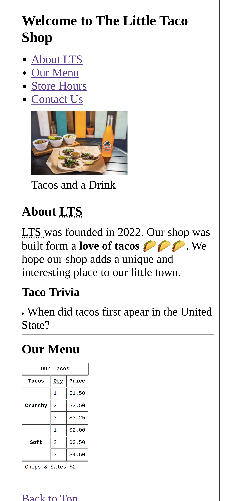
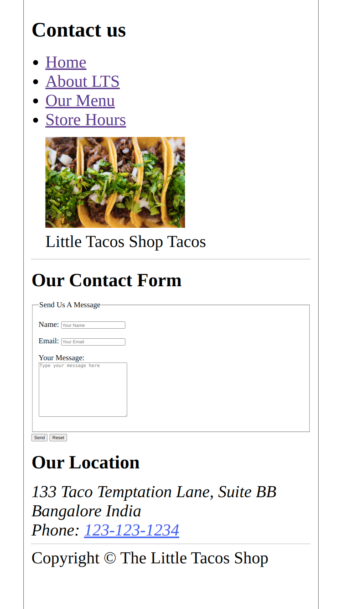
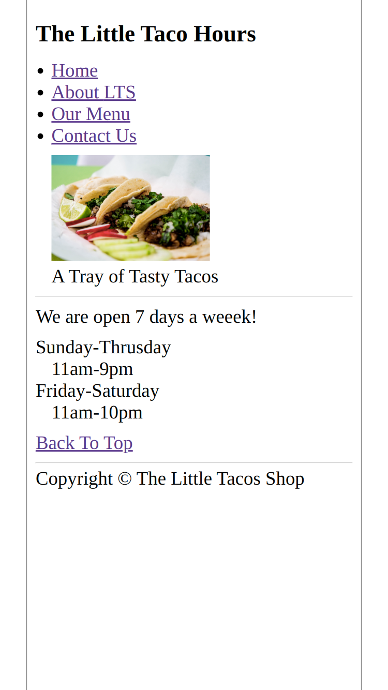

# Little-Taco-Shop
This is my first HTML project on GitHub "The Little Taco Shop". Where we have three pages, 
home page, contact page, and storehouse page.

<table>
 <tr>
    <td>This is Home page</td>
     <td>This is Contact page</td>
     <td>This is Store House page</td>
  </tr>
<tr>
<td></td>
<td></td>
<td></td>
</tr>
</table>
